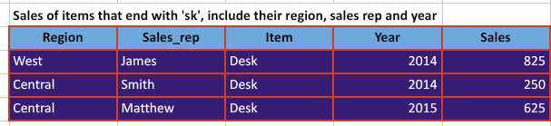

# Skillharvest-Data-Documentation
This is where i documented my project while learning Data Analysis with SkillHarvest

## Project Overview
This Project aims to generate insight into the sales performance of SkillHarvest stationary supplies by some sales representatives, some items and according to some region over the period of two stipulated years. by analysing the various parameters in the data received we seek to gather enough insight to make reseanable decisions which then enable us to tell compelling stories around our data from the insight we got and to kno the best performance from the data.

## Data Source
The primary source of data used here is Data Sale.csv and this is open source data that can be freely downloaded from an open source online like kaggle or FRED or any other data repository site.

## Tools Used
- Ms Excel for data cleaning [Download Here](https:/www.microsoft.com)
- SQL Server (For quering and analysis)
- Power Bi (For reporting)
- Ms PowerPoint (For presentation)

## Data Cleaning and Preparation
Exploratory Data Analysis (EDA) involved exploring of the data to answer some questions about the data such as;
- What is the overall sales trend
- Which products are top seller
- What are the products on peak sales?

## Data Analysis
This is where some basic lines of codes or queries or even some lines of DAX expressions used during the analysis were included.

```
SQL
SELECT *
FROM TABLE 1
WHERE A, B, C = Positive Integers
```




## Result/Findings


